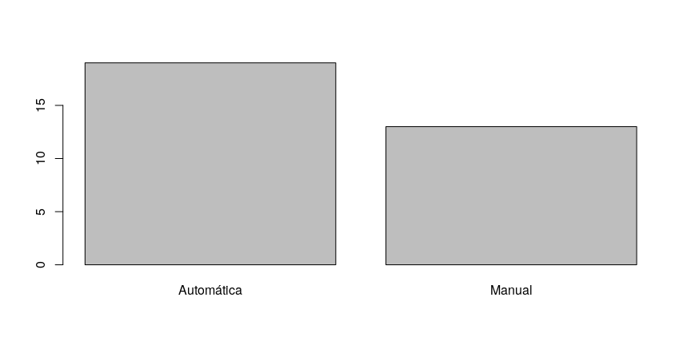
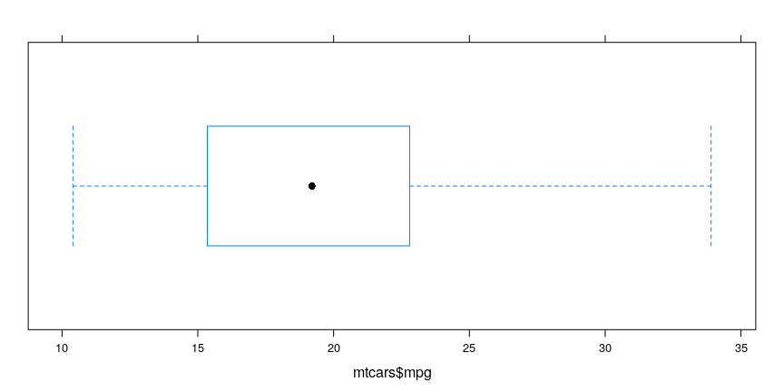
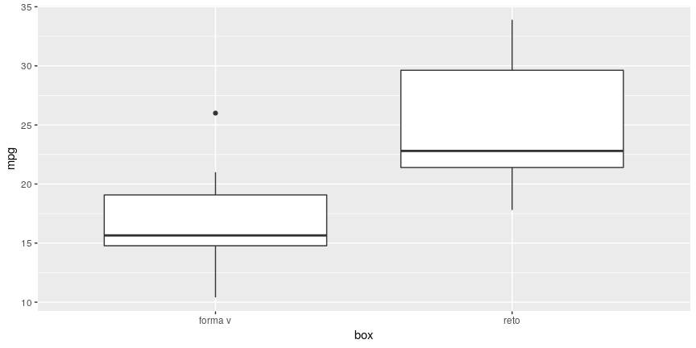

# Entrada e Saída de Dados

## Entrada de dados pelo teclado

Vamos começar com a funcão \(\bf{scan}\). Ela serve para adicionar elementos em um vetor diretamente do console.

Entrando com números:

```r
obj1 <- scan()
```
Ao realizar o comando acima o console irá mudar e o usuário pode adicionar os valores no \(\it{obj1}\) diretamente do console. Para encerrar a entrada de números basta apertar o botão enter duas vezes.

Entrando com texto:

```r
obj2 <- scan(what = "character")
```
Para entrarmos com texto basta utilizarmos o argumento \(\it{what = "character"}\). Funcionará de forma análoga ao anterior. Um cuidado que o usuário deve tomar é que a função interpreta espaços como um novo elemento do objeto, assim nomes compostos não poderiam ser escritos com essa função.

Para resolver o problema acima podemos utilizar a função \(\bf{readLines}\). 


```r
obj3 <- readLines(n = 1)
obj4 <- readLines(n = 2)
```

A função readLines vai funcionar também como a scan no sentido da entrada de dados pelo console. O argumento \(\it{n}\) é referente a quantidade de elementos que o objeto vai receber.

## Entrada e saída de dados usando arquivos

Existem diversas funções que permitem o carregamento de arquivos no R.
Elas possuem diversas formas e são úteis em situações diferentes do dia a dia. Aqui nós vamos abordar as funções que já vem com o R e tambem
uma função especifica para arquivos do excel. Mostraremos também como extraír objetos do R em formatos de arquivo. 

A função \(\bf{read.table}\) é uma das funções mais usadas no R, permite a entrada de diferentes formatos:


```r
#generico <- read.table("nome_arquivo.extensao", header = TRUE,
#                       sep = ";", dec = ",")
```

Na função genérica acima podemos notar que no primeiro argumento se especifica o nome do arquivo. Em \(\it{header}\) é possivel escolher se o usuário quer ou não que a primeira linha do arquivo seja utilizada como nome das colunas. \(\it{sep}\) diz como estão separadas as colunas do seu arquivo e \(\it{dec}\) é o  separador de números decimais.

Alguns exemplos dessa função:


```r
# Importando arquivos com extensão csv

obj5 <- read.table("crabs.csv", header = TRUE,
                   sep = ";", dec = ",")
# Entrada
head(obj5, n = 4L)
```

```
##   especie sexo  FL  RW   CL   CW  BD
## 1    azul    M 8.1 6.7 16.1 19.0 7.0
## 2    azul    M 8.8 7.7 18.1 20.8 7.4
## 3    azul    M 9.2 7.8 19.0 22.4 7.7
## 4    azul    M 9.6 7.9 20.1 23.1 8.2
```

```r
# Importando arquivos com extensão txt

obj6 <- read.table("aula3.txt", header = TRUE,
                   sep = "\t", fill = TRUE)

# Entrada
head(obj6, n = 4L)
```

```
##      Nome Idade Altura      Cursos
## 1    João    22   1.81 Estatística
## 2   Lineu    22   1.92 Estatística
## 3  Nilton    20   1.82 Estatística
## 4 Willian    19   1.69 Estatística
```

```r
# Importando arquivos por uma url

obj7 <- read.table("http://www.leg.ufpr.br/~fernandomayer/data/crabs.csv", header = TRUE,
                   sep = ";", dec = ",")

# Entrada
head(obj7, n = 4L)
```

```
##   especie sexo  FL  RW   CL   CW  BD
## 1    azul    M 8.1 6.7 16.1 19.0 7.0
## 2    azul    M 8.8 7.7 18.1 20.8 7.4
## 3    azul    M 9.2 7.8 19.0 22.4 7.7
## 4    azul    M 9.6 7.9 20.1 23.1 8.2
```


Já a função \(\bf{write.table}\) funciona da seguinte forma:


```r
#generico <- write.table(objeto, file = "nome_arquivo.extensao", 
#                         sep = ";", dec = ",", row.names = FALSE)
```


Na função write.table o primeiro argumento é o objeto no qual se quer 
exportar, \(\it{file}\) se especifica o nome do arquivo de saida e sua extensão. \(\it{row.names}\) é logico e define se o nome das linhas vão ou não serem exportadas com o arquivo. Os outros argumentos são similares aos da função read.table.

Vamos mostrar agora uma função útil para extrair arquivos com extensão xlsx, padrão de arquivos do excel.

Precisaremos do pacote \(\it{gdata}\).


```r
# Instalando pacote
#install.packages("gdata", dependencies = TRUE)

# Carregando pacote
library(gdata)
```

Utilizaremos a função \(\it{read.xls}\) para ler os arquivos.


```r
#generico <- read.xls("nome_arquivo.xlsx", sheet = planilha_desejada, header = TRUE)
```

Na função read.xls segue o mesmo padrão que as outras mostradas até aqui. A única mudança é que se pode escolher qual planilha do arquivo o usuário quer trabalhar com o argumento \(\it{sheet}\). 

Exemplo:

```r
# Importando 
obj8 <- read.xls("aula3.xlsx", sheet = 1, header = TRUE)

# Entrada
head(obj8, n = 4L)
```

```
##      Nome Idade Altura       Curso
## 1    Joao    22   1.81 Estatistica
## 2   Lineu    22   1.92 Estatistica
## 3  Nilton    20   1.82 Estatistica
## 4 Willian    19   1.69 Estatistica
```


# Estrutura dos Dados

É muito importante sabermos a estrutura dos dados que estamos trabalhando, para isso podemos utilizar algumas funções que já estão implementadas no R.

Com a função \(\bf{str}\) podemos observar a classe do nosso objeto, a quantidade de observações, os nomes das colunas e suas respectivas classes.  


```r
str(obj6)
```

```
## 'data.frame':	4 obs. of  4 variables:
##  $ Nome  : Factor w/ 4 levels "João","Lineu",..: 1 2 3 4
##  $ Idade : int  22 22 20 19
##  $ Altura: num  1.81 1.92 1.82 1.69
##  $ Cursos: Factor w/ 1 level "Estatística": 1 1 1 1
```

As funções \(\bf{head}\) e \(\bf{tail}\) retornam, respectivamente, os primeiros e os ultimos valores do objeto.

head:

```r
head(obj6, n = 5L)
```

```
##      Nome Idade Altura      Cursos
## 1    João    22   1.81 Estatística
## 2   Lineu    22   1.92 Estatística
## 3  Nilton    20   1.82 Estatística
## 4 Willian    19   1.69 Estatística
```

O argumento \(\it{n}\) serve para especificar a quantidade de linhas que a função vai retornar.

tail:

```r
tail(obj6, n = 5L)
```

```
##      Nome Idade Altura      Cursos
## 1    João    22   1.81 Estatística
## 2   Lineu    22   1.92 Estatística
## 3  Nilton    20   1.82 Estatística
## 4 Willian    19   1.69 Estatística
```

# Estatísticas 

Podemos utilizar também algumas funções para calcular estatísticas referentes aos nossos objetos. 

São elas:


<table class="table table-striped table-hover" style="margin-left: auto; margin-right: auto;">
 <thead>
  <tr>
   <th style="text-align:left;"> Função </th>
   <th style="text-align:left;"> Calcula </th>
  </tr>
 </thead>
<tbody>
  <tr>
   <td style="text-align:left;"> mean() </td>
   <td style="text-align:left;"> Média </td>
  </tr>
  <tr>
   <td style="text-align:left;"> median() </td>
   <td style="text-align:left;"> Mediana </td>
  </tr>
  <tr>
   <td style="text-align:left;"> min() </td>
   <td style="text-align:left;"> Minimo </td>
  </tr>
  <tr>
   <td style="text-align:left;"> max() </td>
   <td style="text-align:left;"> Maxímo </td>
  </tr>
  <tr>
   <td style="text-align:left;"> var() </td>
   <td style="text-align:left;"> Variância </td>
  </tr>
  <tr>
   <td style="text-align:left;"> sd() </td>
   <td style="text-align:left;"> Desvio Padrão </td>
  </tr>
</tbody>
</table>

A função \(\bf{summary}\) nos retorna algumas estatísticas rapidamente.


```r
summary(obj6$Idade)
```

```
##    Min. 1st Qu.  Median    Mean 3rd Qu.    Max. 
##   19.00   19.75   21.00   20.75   22.00   22.00
```

Podemos obter frequências absolutas de nosso objeto com a função \(\bf{table}\).

Para o exemplo a seguir utilizaremos a base de dados \(\it{iris}\) que por padrão já vem na instalação do R.


```r
# Estrutura 
str(iris)
```

```
## 'data.frame':	150 obs. of  5 variables:
##  $ Sepal.Length: num  5.1 4.9 4.7 4.6 5 5.4 4.6 5 4.4 4.9 ...
##  $ Sepal.Width : num  3.5 3 3.2 3.1 3.6 3.9 3.4 3.4 2.9 3.1 ...
##  $ Petal.Length: num  1.4 1.4 1.3 1.5 1.4 1.7 1.4 1.5 1.4 1.5 ...
##  $ Petal.Width : num  0.2 0.2 0.2 0.2 0.2 0.4 0.3 0.2 0.2 0.1 ...
##  $ Species     : Factor w/ 3 levels "setosa","versicolor",..: 1 1 1 1 1 1 1 1 1 1 ...
```

```r
# Primeiras linhas
head(iris, n = 4L)
```

```
##   Sepal.Length Sepal.Width Petal.Length Petal.Width Species
## 1          5.1         3.5          1.4         0.2  setosa
## 2          4.9         3.0          1.4         0.2  setosa
## 3          4.7         3.2          1.3         0.2  setosa
## 4          4.6         3.1          1.5         0.2  setosa
```

Notem que a coluna \(\it{Species}\) é um fator. Vamos montar uma tabela de frequência para cada espécie (fator):


```r
freq <- table(iris$Species)
freq
```

```
## 
##     setosa versicolor  virginica 
##         50         50         50
```

Podemos obter a proporção com a função \(\bf{prop.table}\).


```r
proporcao <- prop.table(freq)
proporcao
```

```
## 
##     setosa versicolor  virginica 
##  0.3333333  0.3333333  0.3333333
```


# Análise Explanatória de Dados

Uma dos grandes atrativos do software R é a facilidade com que se pode construir bons gráficos. Nesta seção mostraremos diferentes formas de construção de análises explanatórias utilizando três conjuntos de ferramentas distintas. 

Vamos utilizar um conjunto de dados que já vem instalado no R, o \(\it{mtcars}\). As observações desse conjunto são relacionadas a 32 carros e foram extraídas de uma revista de automobilismo em 1974.

Uma pequena descrição das váriaveis do mtcars:
<table class="table table-striped table-hover" style="margin-left: auto; margin-right: auto;">
 <thead>
  <tr>
   <th style="text-align:left;"> Variável </th>
   <th style="text-align:left;"> Descrição </th>
  </tr>
 </thead>
<tbody>
  <tr>
   <td style="text-align:left;"> mpg </td>
   <td style="text-align:left;"> Milhas/galão </td>
  </tr>
  <tr>
   <td style="text-align:left;"> cyl </td>
   <td style="text-align:left;"> Número de cilindros </td>
  </tr>
  <tr>
   <td style="text-align:left;"> disp </td>
   <td style="text-align:left;"> Deslocamento </td>
  </tr>
  <tr>
   <td style="text-align:left;"> hp </td>
   <td style="text-align:left;"> Potência </td>
  </tr>
  <tr>
   <td style="text-align:left;"> drat </td>
   <td style="text-align:left;"> Eixo traseiro </td>
  </tr>
  <tr>
   <td style="text-align:left;"> wt </td>
   <td style="text-align:left;"> Peso (1000 lbs) </td>
  </tr>
  <tr>
   <td style="text-align:left;"> qsec </td>
   <td style="text-align:left;"> 1/4 milha/tempo </td>
  </tr>
  <tr>
   <td style="text-align:left;"> vs </td>
   <td style="text-align:left;"> Motor (0 = forma de V, 1 = reto) </td>
  </tr>
  <tr>
   <td style="text-align:left;"> am </td>
   <td style="text-align:left;"> Transmissão (0 = automática , 1 = manual) </td>
  </tr>
  <tr>
   <td style="text-align:left;"> gear </td>
   <td style="text-align:left;"> Número de marchas </td>
  </tr>
  <tr>
   <td style="text-align:left;"> carb </td>
   <td style="text-align:left;"> Número de carburadores </td>
  </tr>
</tbody>
</table>

Estrutura dos dados


```r
str(mtcars)
```

```
## 'data.frame':	32 obs. of  11 variables:
##  $ mpg : num  21 21 22.8 21.4 18.7 18.1 14.3 24.4 22.8 19.2 ...
##  $ cyl : num  6 6 4 6 8 6 8 4 4 6 ...
##  $ disp: num  160 160 108 258 360 ...
##  $ hp  : num  110 110 93 110 175 105 245 62 95 123 ...
##  $ drat: num  3.9 3.9 3.85 3.08 3.15 2.76 3.21 3.69 3.92 3.92 ...
##  $ wt  : num  2.62 2.88 2.32 3.21 3.44 ...
##  $ qsec: num  16.5 17 18.6 19.4 17 ...
##  $ vs  : num  0 0 1 1 0 1 0 1 1 1 ...
##  $ am  : num  1 1 1 0 0 0 0 0 0 0 ...
##  $ gear: num  4 4 4 3 3 3 3 4 4 4 ...
##  $ carb: num  4 4 1 1 2 1 4 2 2 4 ...
```

Primeiras linhas

<table class="table table-striped table-hover" style="margin-left: auto; margin-right: auto;">
 <thead>
  <tr>
   <th style="text-align:left;">   </th>
   <th style="text-align:right;"> mpg </th>
   <th style="text-align:right;"> cyl </th>
   <th style="text-align:right;"> disp </th>
   <th style="text-align:right;"> hp </th>
   <th style="text-align:right;"> drat </th>
   <th style="text-align:right;"> wt </th>
   <th style="text-align:right;"> qsec </th>
   <th style="text-align:right;"> vs </th>
   <th style="text-align:right;"> am </th>
   <th style="text-align:right;"> gear </th>
   <th style="text-align:right;"> carb </th>
  </tr>
 </thead>
<tbody>
  <tr>
   <td style="text-align:left;"> Mazda RX4 </td>
   <td style="text-align:right;"> 21.0 </td>
   <td style="text-align:right;"> 6 </td>
   <td style="text-align:right;"> 160 </td>
   <td style="text-align:right;"> 110 </td>
   <td style="text-align:right;"> 3.90 </td>
   <td style="text-align:right;"> 2.620 </td>
   <td style="text-align:right;"> 16.46 </td>
   <td style="text-align:right;"> 0 </td>
   <td style="text-align:right;"> 1 </td>
   <td style="text-align:right;"> 4 </td>
   <td style="text-align:right;"> 4 </td>
  </tr>
  <tr>
   <td style="text-align:left;"> Mazda RX4 Wag </td>
   <td style="text-align:right;"> 21.0 </td>
   <td style="text-align:right;"> 6 </td>
   <td style="text-align:right;"> 160 </td>
   <td style="text-align:right;"> 110 </td>
   <td style="text-align:right;"> 3.90 </td>
   <td style="text-align:right;"> 2.875 </td>
   <td style="text-align:right;"> 17.02 </td>
   <td style="text-align:right;"> 0 </td>
   <td style="text-align:right;"> 1 </td>
   <td style="text-align:right;"> 4 </td>
   <td style="text-align:right;"> 4 </td>
  </tr>
  <tr>
   <td style="text-align:left;"> Datsun 710 </td>
   <td style="text-align:right;"> 22.8 </td>
   <td style="text-align:right;"> 4 </td>
   <td style="text-align:right;"> 108 </td>
   <td style="text-align:right;"> 93 </td>
   <td style="text-align:right;"> 3.85 </td>
   <td style="text-align:right;"> 2.320 </td>
   <td style="text-align:right;"> 18.61 </td>
   <td style="text-align:right;"> 1 </td>
   <td style="text-align:right;"> 1 </td>
   <td style="text-align:right;"> 4 </td>
   <td style="text-align:right;"> 1 </td>
  </tr>
  <tr>
   <td style="text-align:left;"> Hornet 4 Drive </td>
   <td style="text-align:right;"> 21.4 </td>
   <td style="text-align:right;"> 6 </td>
   <td style="text-align:right;"> 258 </td>
   <td style="text-align:right;"> 110 </td>
   <td style="text-align:right;"> 3.08 </td>
   <td style="text-align:right;"> 3.215 </td>
   <td style="text-align:right;"> 19.44 </td>
   <td style="text-align:right;"> 1 </td>
   <td style="text-align:right;"> 0 </td>
   <td style="text-align:right;"> 3 </td>
   <td style="text-align:right;"> 1 </td>
  </tr>
  <tr>
   <td style="text-align:left;"> Hornet Sportabout </td>
   <td style="text-align:right;"> 18.7 </td>
   <td style="text-align:right;"> 8 </td>
   <td style="text-align:right;"> 360 </td>
   <td style="text-align:right;"> 175 </td>
   <td style="text-align:right;"> 3.15 </td>
   <td style="text-align:right;"> 3.440 </td>
   <td style="text-align:right;"> 17.02 </td>
   <td style="text-align:right;"> 0 </td>
   <td style="text-align:right;"> 0 </td>
   <td style="text-align:right;"> 3 </td>
   <td style="text-align:right;"> 2 </td>
  </tr>
  <tr>
   <td style="text-align:left;"> Valiant </td>
   <td style="text-align:right;"> 18.1 </td>
   <td style="text-align:right;"> 6 </td>
   <td style="text-align:right;"> 225 </td>
   <td style="text-align:right;"> 105 </td>
   <td style="text-align:right;"> 2.76 </td>
   <td style="text-align:right;"> 3.460 </td>
   <td style="text-align:right;"> 20.22 </td>
   <td style="text-align:right;"> 1 </td>
   <td style="text-align:right;"> 0 </td>
   <td style="text-align:right;"> 3 </td>
   <td style="text-align:right;"> 1 </td>
  </tr>
</tbody>
</table>


## Base

Primeiramente vamos utilizar as funções \(\it{base}\) do R.


### Histograma

Podemos fazer histogramas com a função \(\bf{hist}\):


```r
hist(mtcars$mpg)
```

<!-- -->

Podemos customizar o gráfico para ficar mais atrativo:


```r
hist(mtcars$mpg, xlab = "Milhas/galão", ylab = "Frequência",
     main = "Histograma", col = "darkgreen")
```

<!-- -->


### Densidade

Para montarmos um gráfico de densidade podemos utilizar a função \(\bf{plot}\) em confunto com a função \(\bf{density}\).


```r
plot(density(mtcars$mpg))
```

<!-- -->

Customizando:


```r
plot(density(mtcars$mpg), col = "darkgreen", xlab = "Milhas/galão", ylab = "Densidade", main = "Densidade")

polygon(density(mtcars$mpg), col = "green")
```

<!-- -->

### Boxplot

Usando a função \(\bf{boxplot}\)


```r
boxplot(mtcars$mpg)
```

<!-- -->


Customizando:


```r
boxplot(mtcars$mpg, col = "light green",
        main = "boxplot")
```

<!-- -->

### Barras

Com a função \(\bf{barplot}\) podemos contruir gráficos de barras:


```r
frequencia <- c(Automática = sum(mtcars$am == 0),
                         Manual = sum(mtcars$am == 1))

barplot(frequencia)
```

<!-- -->

Customizando:


```r
barplot(frequencia, xlab = "Tipo de transmissão", ylab = "Frequência",
        main = "Transmissão", col = "darkred")
```

<!-- -->

### Dispersão

Para fazer gráficos de dispersão utilizamos a função \(\bf{plot}\)


```r
plot(mpg ~ hp, data = mtcars)
```

<!-- -->

Customizando:


```r
plot(mpg ~ hp, data = mtcars, col = "darkblue",
     main = "Disperção", xlab = "Potência", ylab = "Milhas/galão")

abline(lm(mpg ~ hp, data = mtcars), col = 2, lwd = 2)
```

<!-- -->

### Boxplot bivariado

Para construir um boxplot utilizando duas variáveis pode-se utilizar novamente a função \(\bf{boxplot}\)


```r
boxplot(mpg ~ vs, data = mtcars)
```

<!-- -->


```r
boxplot(mpg ~ vs, data = mtcars, col = c("darkblue", "darkgreen"),
        xlab = "Motor", main = "Boxplot")
```

<!-- -->


## Lattice 

Vamos agora utilizar o pacote \(\it{lattice}\) para fazer as mesmas análises acima, porém com uma estética diferente. O pacote lattice já vem instalado no R, para a utilização devemos apenas carregar o pacote.


```r
library(lattice) # Carregando
```

### Histograma

Para fazer um histograma utilizaremos a função \(\bf{histogram}\):


```r
histogram(mtcars$mpg)
```

<!-- -->

Customizando:


```r
histogram(mtcars$mpg, xlab = "Milhas/galão", ylab = "Frequência",
     main = "Histograma", col = "darkgreen")
```

<!-- -->


### Densidade

Para montarmos um gráfico de densidade utilizaremos a função \(\bf{densityplot}\)


```r
densityplot(mtcars$mpg)
```

<!-- -->

Customizando:


```r
densityplot(mtcars$mpg, col = "darkgreen", xlab = "Milhas/galão", ylab = "Densidade", main = "Densidade", plot.points = FALSE)
```

<!-- -->

### Boxplot

Usando a função \(\bf{bwplot}\) podemos construir boxplots


```r
bwplot(mtcars$mpg)
```

<!-- -->


Customizando:


```r
bwplot(mtcars$mpg, col = "lightgreen", main = "boxplot", xlab = "Milhas/galão")
```

<!-- -->

### Barras

Com a função \(\bf{barchart}\) podemos contruir gráficos de barras:


```r
frequencia <- c(Automática = sum(mtcars$am == 0),
                         Manual = sum(mtcars$am == 1))

barchart(frequencia)
```

<!-- -->

Customizando:


```r
barchart(frequencia, xlab = "Tipo de transmissão", ylab = "Frequência",
        main = "Transmissão", col = "darkred", horizontal = FALSE
)
```

<!-- -->

### Dispersão

Para fazer gráficos de dispersão utilizamos a função \(\bf{xyplot}\)


```r
xyplot(mpg ~ hp, data = mtcars)
```

<!-- -->

Customizando:


```r
xyplot(mpg ~ hp, data = mtcars,
       main = "Dispersão",
       xlab = "Potencia",
       ylab = "Milhas/galão",
       panel = function(x, y){
       panel.xyplot(x, y)
       panel.abline(lm(mpg ~ hp, data = mtcars))
           })
```

<!-- -->

### Boxplot bivariado

Para construir um boxplot utilizando duas variáveis pode-se utilizar novamente a função \(\bf{bwplot}\)


```r
bwplot(mpg ~ vs, data = mtcars, horizontal = FALSE)
```

<!-- -->


```r
bwplot(mpg ~ vs, data = mtcars, col = c("darkblue", "darkgreen"),
        xlab = "Motor", main = "Boxplot", horizontal = FALSE, border = c("green", "blue"))
```

<!-- -->

## ggplot2

Por fim vamos apresentar um pacote com muitos recursos gráficos e muito popular entre a comunidade do R, o \(\it{ggplot2}\). O pacote ggplot2 tem por característica a construção de gráficos por camada. Nesta seção apresentaremos os gráficos já mostradados acima agora com a sintaxe do ggplot.

É importante frisar que o ggplot, por ser construído por camadas, possui uma forma de escrita um pouco diferente do base e do lattice. Todos os gráficos feitos no ggplot2 vão começar quase sempre da mesma forma, utilizando a função \(\bf{ggplot}\).

Uma forma genérica seria:


```r
library(ggplot2)
# ggplot(data = df (data.frame) , mapping = aes(x = obj1 (df$obj1), y = obj2 (df$obj2) )) + geom_tipodografico 
```


### Histograma

Começando com histogramas, como dito acima vamos começar com a função ggplot e utilizaremos geom_histogram para construir o histograma


```r
ggplot(data = mtcars, mapping = aes(x = mpg)) + geom_histogram()
```

```
## `stat_bin()` using `bins = 30`. Pick better value with `binwidth`.
```

<!-- -->

A forma de customização vai seguir o mesmo princípio das camadas, onde podemos adicionando coisas ao gráfico com o operador +:


```r
ggplot(data = mtcars, mapping = aes(x = mpg)) + geom_histogram(colour = "darkblue", fill = "blue") + ggtitle("Histograma") + xlab("Milhas/galão") + ylab("Frequência") + theme_bw() + theme(plot.title = element_text(hjust = 0.5))
```

<!-- -->


### Densidade

Para montarmos um gráfico de densidade vamos utilizar geom_density


```r
ggplot(data = mtcars, mapping = aes(x = mpg)) +
  geom_density()
```

<!-- -->

Customizando:


```r
ggplot(data = mtcars, mapping = aes(x = mpg)) +
  geom_density(colour = "darkblue", fill = "lightblue") + ggtitle("Densidade") + xlab("Milhas/galão") + ylab("Densidade") + theme_bw() + theme(plot.title = element_text(hjust = 0.5))
```

<!-- -->

### Boxplot

Usando geom_boxplot podemos construir boxplots


```r
ggplot(data = mtcars, mapping = aes(y = mpg)) + geom_boxplot()
```

<!-- -->


Customizando:


```r
ggplot(data = mtcars, mapping = aes(y = mpg)) + geom_boxplot(colour = "darkblue", fill = "lightblue") + ggtitle("Boxplot") + ylab("Milhas/galão") + theme_bw() + theme(plot.title = element_text(hjust = 0.5))
```

<!-- -->

### Barras

Com geom_bar podemos contruir gráficos de barras:


```r
frequencia <- c(Automática = sum(mtcars$am == 0),
                         Manual = sum(mtcars$am == 1))

barras <- data.frame(nivel = c("Automática", "Manual"),
                     freq = frequencia) 

ggplot(data = barras, mapping = aes(x = nivel, y = freq)) + geom_bar(stat="identity")
```

<!-- -->

Customizando:


```r
ggplot(data = barras, mapping = aes(x = nivel, y = freq)) + geom_bar(stat = "identity", fill = "darkred", colour = "darkred") + ggtitle("Barras") + xlab("Tipo de transmissão") + ylab("Frequência") + theme_bw() + theme(plot.title = element_text(hjust = 0.5))
```

<!-- -->

### Dispersão

Para fazer gráficos de dispersão utilizamos geom_point


```r
ggplot(data = mtcars, mapping = aes(x = hp, y = mpg)) + geom_point()
```

<!-- -->

Customizando:


```r
ggplot(data = mtcars, mapping = aes(x = hp, y = mpg)) + geom_point() + ggtitle("Dispersão") + xlab("Potencia") + ylab("Milhas/galão") + theme_bw() + theme(plot.title = element_text(hjust = 0.5))
```

<!-- -->

### Boxplot bivariado

Para construir um boxplot utilizando duas variáveis vamos utilizar novamente geom_boxplot


```r
mtcars$box <- ifelse(mtcars$vs == 0, "forma v", "reto")

ggplot(data = mtcars, mapping = aes(x = box, y = mpg)) + geom_boxplot() 
```

<!-- -->

Customizando:


```r
ggplot(data = mtcars, mapping = aes(x = box, y = mpg)) + geom_boxplot(colour = "darkblue", fill = "lightblue") + ggtitle("Boxplot") + ylab("Milhas/galão") + theme_bw() + theme(plot.title = element_text(hjust = 0.5))
```

<!-- -->
